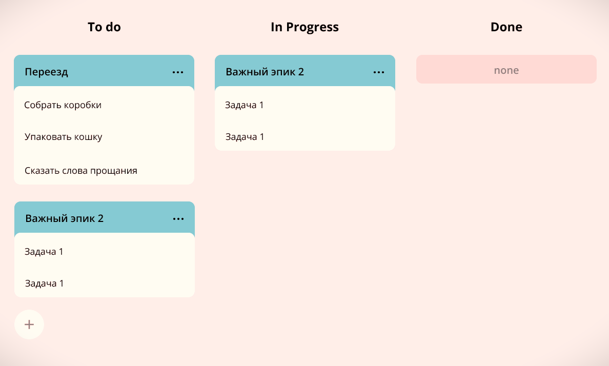
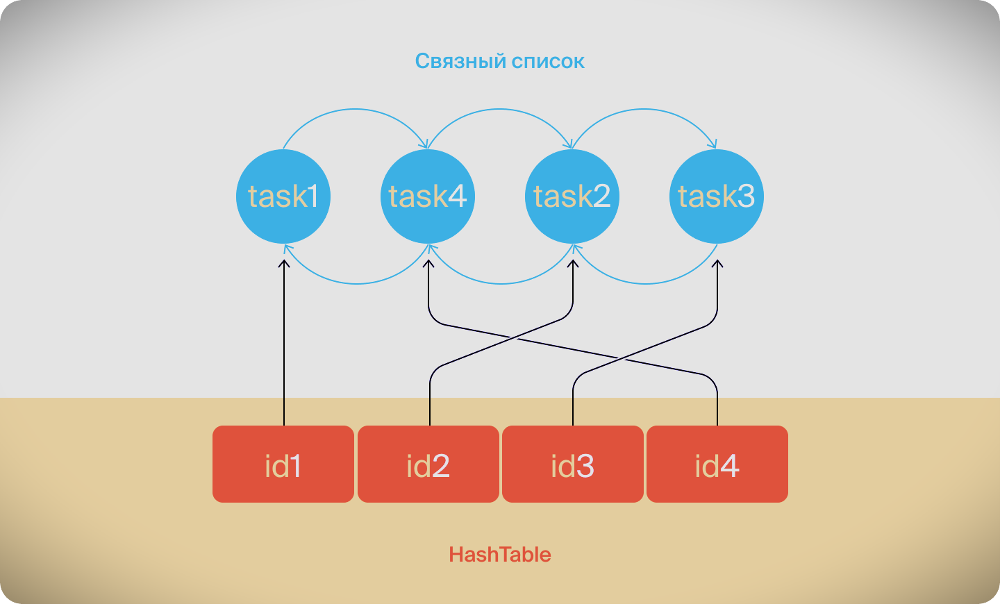

# Kanban board
### Бэкенд приложения для наглядного и эффективного управления задачами по методологии Agile.

> ### Технологии:
> ### Java Core | Stream API | REST API | GSON | JUnit |
### Объекты взаимодействия и их свойства
Основной объект приложения - **задача `TASK`**, от которой наследуют свойства и функции **эпик `EPIC`** и 
**подзадача `SUBTASK`**.

**Свойства задач:**
- Уникальный целочисленный идентификатор:`id`.
- Наименование и описание.
- Время начала `startTime` и длительность выполнения `duration`.
- Статус работы над задачей: 
   - `NEW` - задача создана и **не взята** в работу;
   - `IN_PROGRESS` - задача в работе;
   - `DONE` - задача выполнена.
- Эпик хранит список идентификаторов своих подзадач.
- Эпик рассчитывает свое время выполнения, как разницу самого раннего `startTime` 
и самого позднего `endTime` среди своих подзадач.
- Подзадача хранит идентификатор своего эпика-родителя.

### Функционал приложения
Основным функциональным ядром приложения является **менеджер задач**, представленный интерфейсом [TaskManager][1], 
базовые методы которого реализуют:
- Хранение задач всех типов.
- CRUD-методы для каждого из типа задач:
   - Создание. Сам объект должен передаваться в качестве параметра метода.
   - Получение задачи по идентификатору.
   - Получение списка всех задач.
   - Получение списка всех подзадач определённого эпика.
   - Обновление. Новая версия объекта с верным идентификатором передаётся в виде параметра метода.
   - Удаление задачи по идентификатору.
   - Удаление всех задач.
- Получение истории последних 10 просмотров, обращений к задачам.

### Особенности реализации логики приложения
<details>
<summary><b>Статус выполнения задач</b></summary>

Менеджер сам не выбирает статус для задачи. Информация о нём приходит менеджеру вместе с информацией о самой задаче.
По этим данным в одном случае он будет сохранять статус, в другом - будет рассчитывать.<br>
Статус выполнения эпика рассчитывается из статуса его подзадач:
- Если у эпика нет подзадач или все они имеют статус `NEW`, то статус должен быть `NEW`.
- Если все подзадачи имеют статус `DONE`, то и эпик считается завершённым — со статусом `DONE`.
- Во всех остальных случаях статус должен быть `IN_PROGRESS`.
</details>

<details>
<summary><b>Приоритет выполнения задач</b></summary>

Менеджер по запросу предоставляет список задач, где критерием приоритета является время начала задачи `startTime`.
Задачи, у которых не указаны временные свойства, вторично сортируются в порядке возрастания по значению `id`.

Также реализован метод, выполняющий проверку пересечения времени выполнения создаваемых и обновляемых задач,
с асимптотической сложностью **O(1)**.<br> 
Для этого период планирования (*прим. год*) делится на интервалы равные 15 минутам и реализуется 
в виде структуры данных `Map<LocalDateTime, Boolean>`, где ключом является каждый интервал периода планирования, 
а значением — объект `boolean` (свободно время или нет).<br>
В итоге для эффективного поиска пересечений достаточно будет проверить, что свободны все 15-минутные интервалы 
создаваемой или обновляемой задачи.
</details>

<details>
<summary><b>История просмотров задач</b></summary>

Интерфейс `HistoryManager` предоставляет основные методы для работы с историей просмотров задач:
```java
    void add(Task task); // добавить просмотр/обращение к задаче в хранилище HistoryManager

    void remove(int id); // удалить просмотр задачи из хранилища HistoryManager  
   
    List<Task> getHistory(); // получить список последних 10 просмотров задач
```
Интерфейс `HistoryManager` имплементирует класс [InMemoryHistoryManager][2] и реализует хранение задач 
структурой данных `Map<Integer, Node<Task>> historyViews`, где ключ - `id` задачи, а значение - объект класса `Node<Task>`.<br>
У вложенного приватного класса `Node<Task>` есть следующие поля:
```java
    Task data; // поле хранит ТЕКУЩИЙ объект-просмотр
    Node<Task> next; // поле хранит СЛЕДУЮЩИЙ объект-просмотр (пока нет след. просмотра - null)
    Node<Task> prev; // поле хранит ПРЕДЫДУЩИЙ объект-просмотр (если первый просмотр - null)
```
При этом `InMemoryHistoryManager` хранит в полях первый и последний просмотр задач: 
`Node<Task> first` и `Node<Task> last`.<br>
В совокупности с `Node<Task> first, Node<Task> last` значения `historyViews` образуют структуру данных двусвязного списка, 
так называемого `CustomLinkedList`, где каждый новый просмотр добавляется в конец списка.<br>
Если какая-либо задача просматривалась несколько раз, **в истории отображается только последний просмотр**. 
Предыдущий просмотр удаляется сразу же после появления нового за **O(1)** благодаря реализации хранилища 
в виде `Map<Integer, Node<Task>> historyViews`.


</details>

> *Все вышеописанные функции реализованы в базовой имплементации менеджера задач `InMemoryTaskManager`.*

### Особенности реализации хранения данных приложения
За хранение задач отвечают следующие имплементации [TaskManager][1]:
- [InMemoryTaskManager][3] - основная реализация менеджера со всеми необходимыми CRUD-методами, сохраняющая задачи 
в структурах данных `Map<Integer, Task>; Map<Integer, Epic>; Map<Integer, Subtask>` 
в оперативную память устройства с запущенной программой.
- [FileBackedTasksManager][4] - реализация менеджера, **наследуя** функционал и свойства `InMemoryTaskManager`, 
сохраняет данные в csv-файл.
- [HttpTaskManager][5] - реализация менеджера, **наследуя** функционал и свойства `FileBackedTasksManager`, 
выполняет сериализацию и десериализацию данных при их сохранении/получении с **KEY-VALUE сервера** [KVServer][6], 
где ключом является тип сохраняемых данных: `task, epic, subtask, history`, а значением - сохраняемые данные, 
передаваемые в формате `json` в теле HTTP-запроса.

### Реализация REST API приложения
 REST API приложения реализует класс-сервер [HttpTaskServer][7], обрабатывая запросы **конечного клиента** 
 по эндпоинтам API-сервиса, делегируя обработку данных соответствующим CRUD-методам `HttpTaskManager`.<br>

 `HttpTaskManager` в свою очередь обращается к классу-клиенту [KVTaskClient][8], передавая его методам данные 
 в формате ключ-значение (*прим. key:task, value: json-data*).<br>
 `KVTaskClient` при первом обращении конечного клиента запрашивает у `KVServer` **api-token** 
 для дальнейшей аутентификации по нему **конечного клиента**, который авторизуется и получает доступ 
 к своим данным - списку задач.<br>
 Структура объектов взаимодействия API приложения:
```java
FinalClient <-> HttpTaskServer <-> HttpTaskManager <-> KVTaskClient <-> KVServer
(Web Browser)                           (API)                          (Storage)
```
`HttpTaskServer` обрабатывает запросы **конечного клиента** по следующим эндпоинтам:
- `/tasks` - только GET-запросы получения всех существующих задач, сортированных по приоритету - время `startTime`.
- `/tasks/<key>?id=` - GET/DELETE-запросы по `id` (целое число), где `<key>` - тип задачи `task, epic, subtask`.
- `/tasks/<key>` - GET/DELETE-запросы, POST-запросы с данными в теле запроса, где `<key>` - тип задачи `task, epic, subtask`.
- `/tasks/subtask/epic?id=` - GET-запрос на получение всех подзадач `subtask` по `id` эпика.
- `/tasks/history` - GET-запрос на получение истории вызова/просмотра задач.

### Запуск и тестирование приложения
<details>
<summary><b>Запуск приложения</b></summary>

1. Выполните клонирование репозитория:
   - используя web URL: `https://github.com/AlexanderBesedin/java-kanban.git`
   - используя SSH-ключ: `git@github.com:AlexanderBesedin/java-kanban.git`
   - или просто скачайте zip-архив по [ссылке][15].
2. Запустите файл проекта в выбранной IDE по пути: `src/main/java/Main.java`.
3. Приложение работает по адресу: `http://localhost:8080/tasks`.
</details>

<details>
<summary><b>Запуск unit-тестов</b></summary>

Используя выбранную IDE, перейдите в директорию `src/test/java`:
1. Для тестирования классов-моделей запустите тесты из [директории][14] `ru/practicum/kanban/model`.
2. Для тестирования классов менеджеров запустите:
   - [TaskManagerTest][9] - абстрактный дженерик-класс `TaskManagerTest<T extends TaskManager>`,
   запускающий все тесты для всех реализаций `TaskManager`.
   - [InMemoryTaskManagerTest][10] - класс, тестирующий `InMemoryTaskManager`.
   - [FileBackedTasksManagerTest][11] - класс, тестирующий `FileBackedTasksManager`.
   - [HttpTaskManagerTest][12] - класс, тестирующий `HttpTaskManager`.
3. Для тестирования эндпоинтов класса HttpTaskServer запустите [HttpTaskServerTest][13].
</details>

<details>
<summary><b>Запуск API-тестов</b></summary>

1. Запустите файл проекта в выбранной IDE по пути `src/main/java/Main.java`.
2. Импортируйте [json-коллекцию](src/main/resources/kanbanTests.json) в выбранном вами testAPI-клиенте (*напр. Postman, Insomnia*).
3. Запустите тесты коллекции. При запуске отдельных тестов коллекции учитывайте их порядок вызова 
и результат вызова предыдущих тестов.
</details>

### Статус проекта 
На данный момент проект завершен, возможен небольшой рефакторинг методов, структуры для приведения 
в соответствие лучшим практикам.


[1]: src/main/java/ru/practicum/kanban/service/manager/TaskManager.java
[2]: src/main/java/ru/practicum/kanban/service/manager/InMemoryHistoryManager.java
[3]: src/main/java/ru/practicum/kanban/service/manager/InMemoryTaskManager.java
[4]: src/main/java/ru/practicum/kanban/service/manager/FileBackedTasksManager.java
[5]: src/main/java/ru/practicum/kanban/service/manager/HttpTaskManager.java
[6]: src/main/java/ru/practicum/kanban/http/KVServer.java
[7]: src/main/java/ru/practicum/kanban/http/HttpTaskServer.java
[8]: src/main/java/ru/practicum/kanban/http/KVTaskClient.java
[9]: src/test/java/ru/practicum/kanban/service/manager/TaskManagerTest.java
[10]: src/test/java/ru/practicum/kanban/service/manager/InMemoryTaskManagerTest.java
[11]: src/test/java/ru/practicum/kanban/service/manager/FileBackedTasksManagerTest.java
[12]: src/test/java/ru/practicum/kanban/service/manager/HttpTaskManagerTest.java
[13]: src/test/java/ru/practicum/kanban/http/HttpTaskServerTest.java
[14]: src/test/java/ru/practicum/kanban/model
[15]: https://github.com/AlexanderBesedin/java-kanban/archive/refs/heads/main.zip "Download archive"
